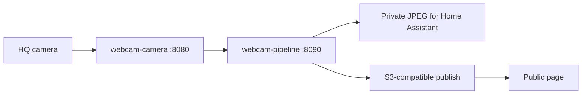
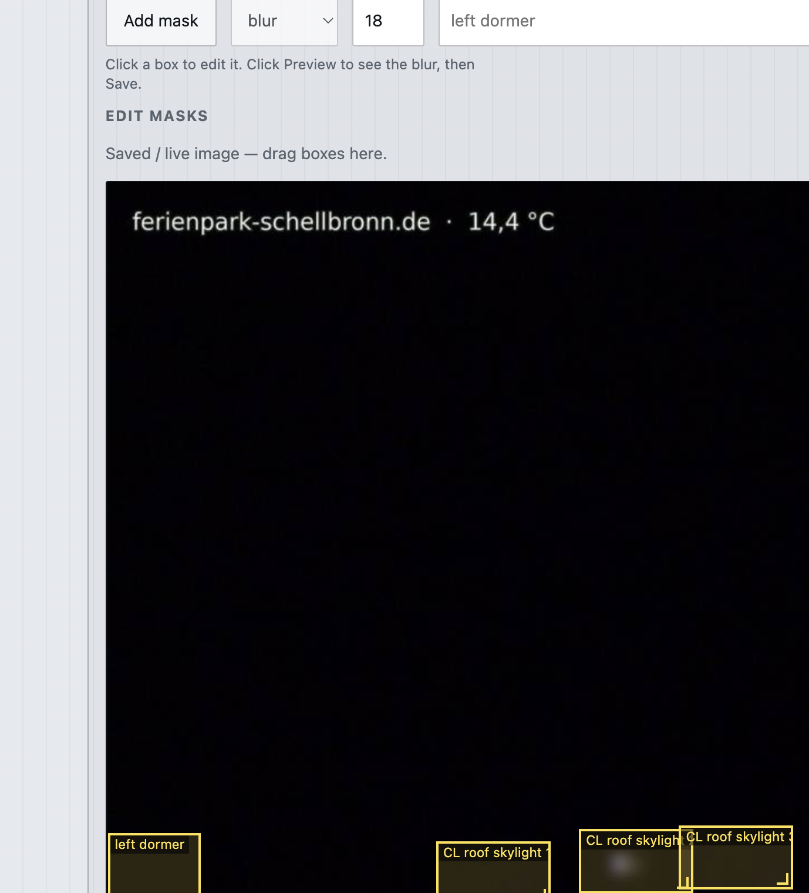
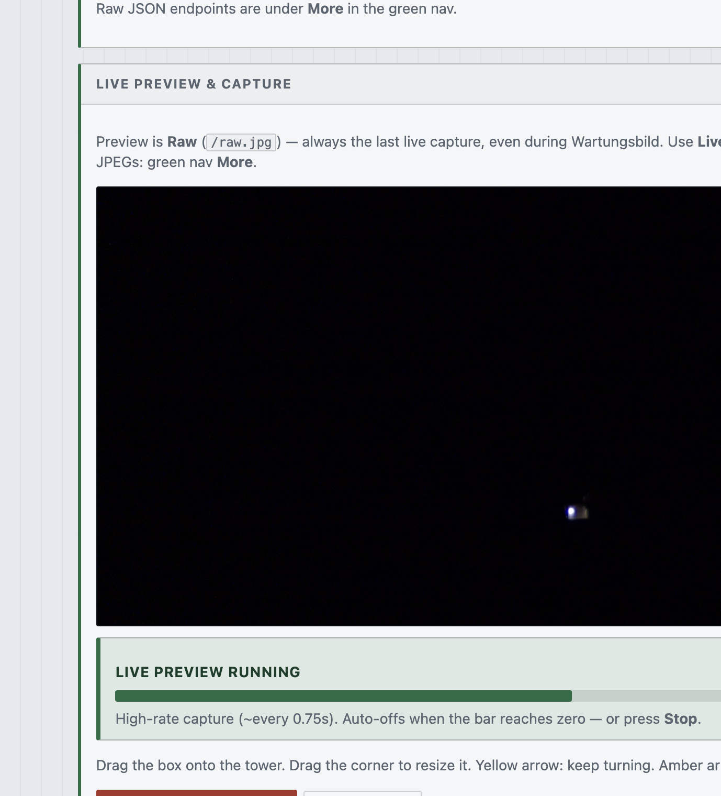
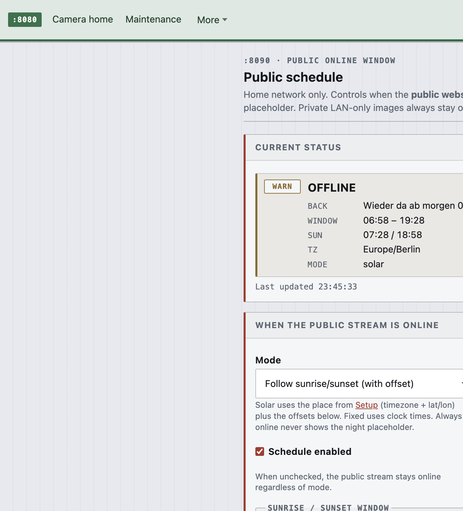

# DIY home webcam

[](LICENSE)

A headless Raspberry Pi captures a still JPEG, keeps a private view on your LAN, and can publish a privacy-filtered public JPEG to Cloudflare R2 or any S3-compatible store (or keep it local / off).



## Features

Two systemd services on one Pi: capture on `:8080`, variants and publish on `:8090`. Originals stay on the LAN. Only a public crop you chose — with privacy masks — can leave the house.

### Hardware on the window

HQ camera on a tall stand, Pi 5 in the official case, CSI flex to the sill. Crop and masks are software; the mount just points the lens.


### Drag-to-edit crop and privacy masks

On Variants (`:8090/variants/ui`), drag a **cyan** rectangle on the full camera frame to set the crop (writes `crop` LTRB in YAML; output still cover-fits without stretching). Neighbor windows get **yellow** rectangles on the served preview — blur, pixelate, or black. Labels stay in YAML (not drawn on the JPEG). Preview, then Save.



### Focus meter (sharpness score)

Manual CS lenses need a real focus aid. Camera home draws a **draggable box** on the raw preview (`/raw.jpg`). The score is the **variance of a Laplacian** on that region after a downscale to ≤480×320 — higher means crisper edges.



### Solar schedule for the public stream

Public live follows sunrise/sunset (with offsets), fixed clock times, or always-on. Night uploads a placeholder; the private LAN JPEG stays live.



### Also worth knowing

- **Flashable image + setup AP** — GitHub Actions builds a Lite image; if Imager skipped Wi-Fi, join `Webcam-Setup` and finish on `:8090/setup/ui` ([docs/diy/BUILD.md](docs/diy/BUILD.md))
- **Wartungsbild** — maintenance placeholder for the public livestream while capture keeps running; private stays on raw
- **S3-compatible publish** — Cloudflare R2 preset, custom S3 (MinIO / AWS / Wasabi / B2), local outbox, or off — Setup UI + [docs/diy/PUBLISH.md](docs/diy/PUBLISH.md)
- **Site badge + temperature** — cream burn-in (hostname · outdoor °C) on public frames
- **Cover-fit output** — visual crop + YAML crop scale into width×height without stretching
- **Home Assistant** — YAML-only package; poll the private LAN JPEG
- **Timelapse** — build MP4/GIF from saved daylight frames on the Pi

## Quick start

```bash
git clone https://github.com/JavanXD/diy-home-webcam.git
cd diy-home-webcam
make test
./scripts/smoke-local.sh
```

## Install on a Raspberry Pi

Parts and flash steps: [docs/diy/SHOPPING-LIST.md](docs/diy/SHOPPING-LIST.md) and [docs/diy/BUILD.md](docs/diy/BUILD.md). Prefer the **flashable image** from the Build Pi image workflow; or clone and:

```bash
sudo ./pi/provision.sh
```

Start from [`examples/`](examples/) / [`cameras/example/`](cameras/example/). Field list: [examples/README.md](examples/README.md).

## Documentation

| | |
|---|---|
| [DIY hub](docs/diy/README.md) | Parts, build, photos |
| [Shopping list](docs/diy/SHOPPING-LIST.md) | Canonical BOM |
| [Build](docs/diy/BUILD.md) | Flashable image, setup AP, provision, optional publish / HA |
| [Publish](docs/diy/PUBLISH.md) | R2 / MinIO / AWS S3 / local outbox / off |
| [Templates](examples/README.md) | Camera, pipeline, publish env, Worker, Home Assistant |
| [Architecture](docs/ARCHITECTURE.md) | What each process owns |
| [LAN pages](docs/LAN-UI.md) | Maintenance, schedule, variants editor |
| [Pi host](docs/PI-HOST.md) | NVMe boot, headless tuning, network |
| [Troubleshooting](docs/TROUBLESHOOTING.md) | Health checks |
| [Cost](docs/COST-PERF.md) | Free-plan defaults |

## Privacy

Originals and variants marked private are served on the LAN. Only a public variant with `publish: true` and a live object key is uploaded. Credentials belong in `/etc/webcam-pipeline/env` on the Pi (`AWS_*` names). The blank file is [`examples/pi/r2.env`](examples/pi/r2.env). Do not commit tokens.

`:8080` and `:8090` have no login. Keep them off the public internet. Details: [SECURITY.md](SECURITY.md).

## Contributing

[CONTRIBUTING.md](CONTRIBUTING.md) · [Code of conduct](CODE_OF_CONDUCT.md) · [Security](SECURITY.md)

## License

[MIT](LICENSE)
