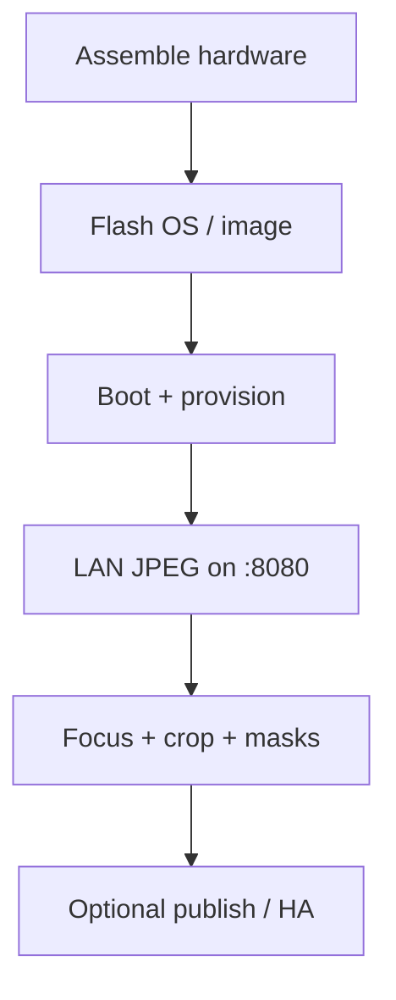
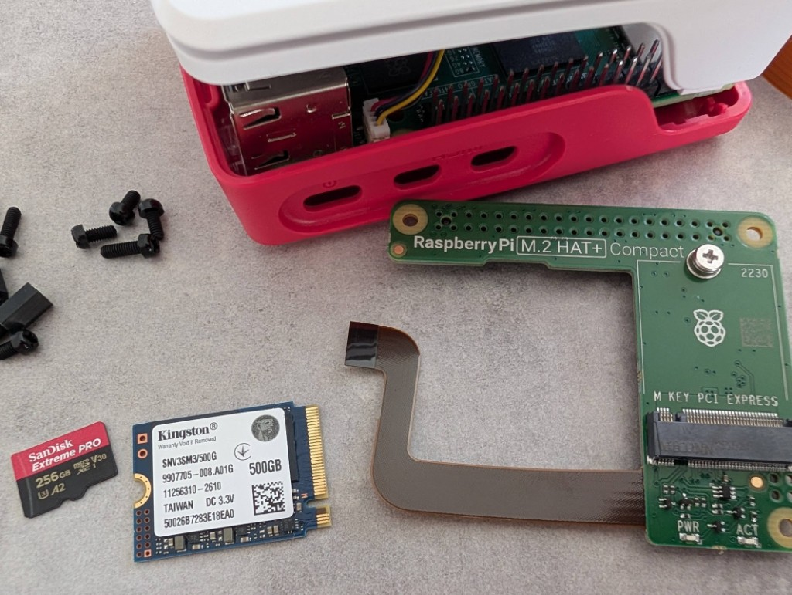
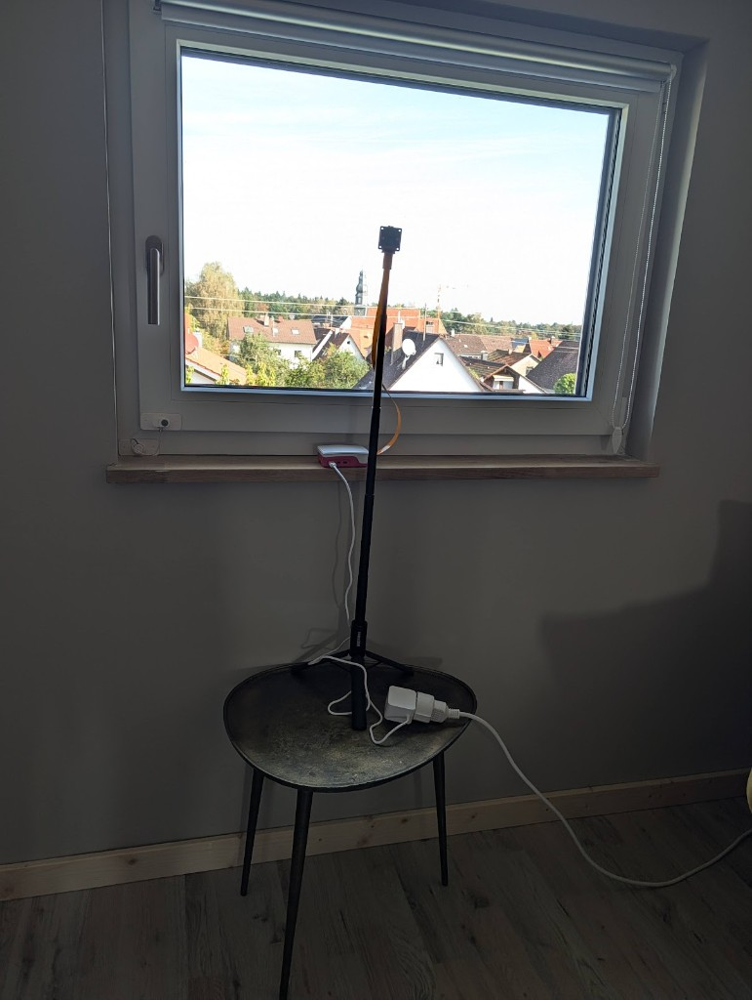
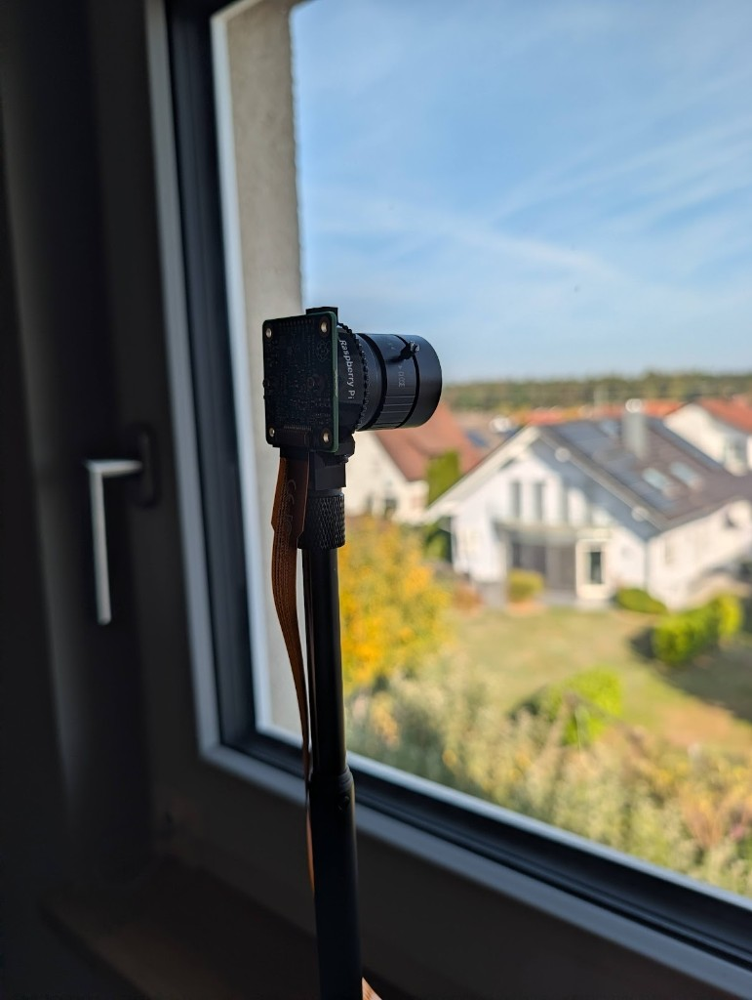
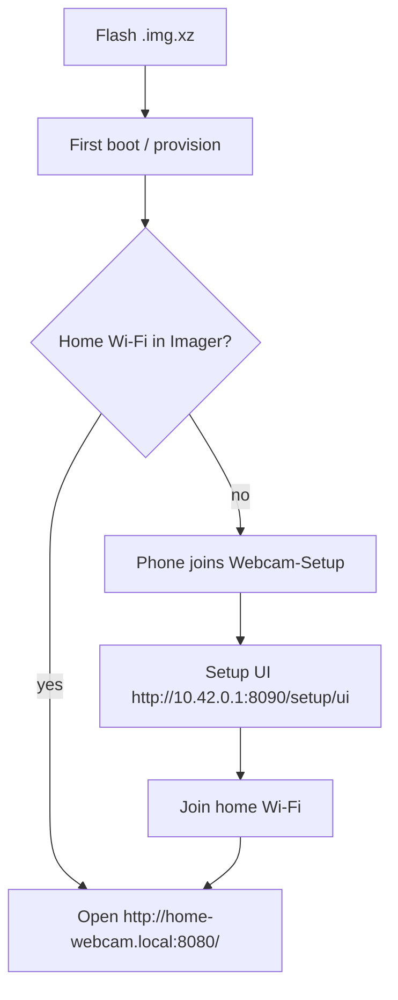
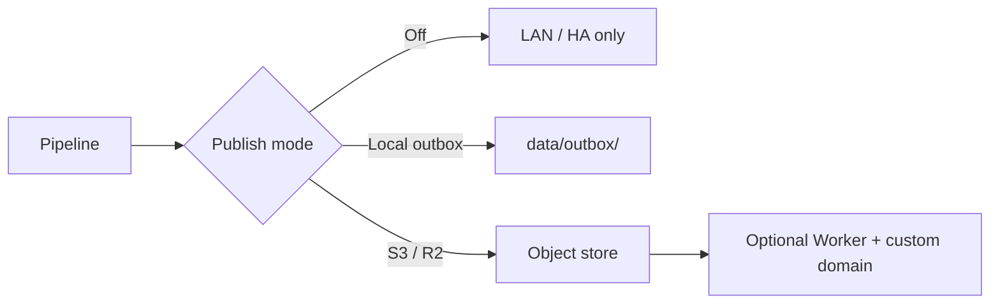

# Build

From a blank microSD to a LAN JPEG, then optional public hosting. Parts: [SHOPPING-LIST.md](SHOPPING-LIST.md). Your own names and crops: [examples/README.md](../../examples/README.md).

This checkout ships a starter camera called `example`. The **DIY flashable image** defaults to the generic `example` camera and hostname `home-webcam`. To start a different camera from a blank OS, copy the example **before** the first pipeline install so `pipeline.yaml` lists your id.



## 1. Assemble

Start from the [minimum SD kit](SHOPPING-LIST.md#minimum-kit-lan-only-microsd) unless you already bought the [reference build](SHOPPING-LIST.md#reference-build-this-pi) extras.

1. Lens (CS-mount, e.g. LN050 16 mm — or shorter for a garden): unscrew the 5 mm C–CS adapter ring that is already on the HQ camera (SC0261) and set it aside. Screw the lens onto the camera body until it stops. A C-mount lens is the opposite: leave the ring on and screw the lens onto the ring. Details under [Focus](#focus) below.
2. Connect the HQ camera ribbon to the **Pi 5** CSI connector with a Pi 5–compatible flex (15-pin camera ↔ 22-pin Pi). Latch closed; contacts oriented per the Pi 5 silkscreen.
3. Power supply unplugged. Insert the microSD after it is flashed.
4. Optional later: M.2 HAT+ Compact + NVMe (reference build). First boot from the SD card; move the OS later with `pi/scripts/migrate-os-to-nvme.sh` ([docs/PI-HOST.md](../PI-HOST.md)).

Reference extras (not required day one):





## 2. Get the OS onto the card

### Path A — Flashable image (primary)

GitHub Actions workflow **Build Pi image** (`.github/workflows/build-pi-image.yml`) builds a 64-bit Lite image via [pi-gen](https://github.com/RPi-Distro/pi-gen). Manual dispatch only (not on every push). Releases can attach the same artifact.

| Image default | Value |
|---------------|--------|
| Hostname | `home-webcam` |
| App tree | `/opt/home-webcam-pipeline` |
| Camera | `example` (from `examples/`) |
| R2 / secrets | Empty placeholders only |
| Setup AP | `webcam-setup-ap.service` — SSID `Webcam-Setup` only when no home Wi-Fi profile exists |

1. Download `home-webcam-*.img.xz` from the workflow artifact (or a GitHub Release).
2. [Raspberry Pi Imager](https://www.raspberrypi.com/software/) → **Use custom** → pick the `.img.xz`.  
   Optional: set Wi-Fi + SSH public key in Imager (recommended if you already know the home SSID).
3. Or: `xz -dc home-webcam-*.img.xz | sudo dd of=/dev/sdX bs=4M status=progress conv=fsync`
4. Boot. First boot runs provision (several minutes). Hostname is **`home-webcam`**.

#### First boot when Imager skipped Wi-Fi



1. On your phone, join Wi-Fi **`Webcam-Setup`**, password **`webcam-setup`** (temporary DIY password; change or disable after first join — see below).
2. Open `http://10.42.0.1:8090/setup/ui` (many phones show a captive page that redirects there).
3. Note the **Find this Pi** card (hostname, `*.local` name, current / last IPv4) before you leave the AP.
4. Scan → pick your home network → **Join Wi-Fi**. The Pi leaves the setup AP and joins home. The success banner shows the new LAN IPv4 when DHCP answers in time.
5. Switch the phone back to home Wi-Fi. Open the camera UI using one of:

| How | Example |
|-----|---------|
| mDNS | `http://home-webcam.local:8080/` (flashable-image hostname) |
| IPv4 from Setup | `http://192.168.x.x:8080/` (shown after Join / on Find this Pi) |
| Router client list | Look for hostname `home-webcam` in the DHCP / Wi-Fi client list |

**Android note:** many Android browsers do **not** resolve `*.local` (mDNS) reliably. Prefer the IPv4 from Setup or the router’s client list. iOS / macOS / most Linux desktops usually resolve `home-webcam.local` when Avahi is running on the Pi.

The setup AP starts **only** when there is no saved home Wi-Fi profile, Wi-Fi is not already associated, and ethernet has no IPv4. A Pi that already has NetworkManager Wi-Fi will **not** enter AP mode. Disable forever: `sudo touch /etc/webcam-pipeline/setup-ap.disabled`.

Still add your own crops and privacy masks before a public JPEG. Cloudflare / Worker keys are optional — see [PUBLISH.md](PUBLISH.md).

**Local pi-gen (optional):** needs Docker and privilege; from the repo root run `./image/build-with-pi-gen.sh`. Output under `image/pi-gen/deploy/` (gitignored).

### Path B — Imager + clone (advanced)

1. [Raspberry Pi Imager](https://www.raspberrypi.com/software/) → **Raspberry Pi OS (other) → Raspberry Pi OS Lite (64-bit)**.
2. OS customisation: hostname, SSH with your **public** key, Wi-Fi or Ethernet, timezone.
3. Write the card, boot, confirm SSH.
4. Clone or sync this repo, then run provision (next section).

If you skipped Wi-Fi in Imager, the same **Webcam-Setup** AP is installed by `pi/provision.sh` and behaves as in Path A.

Do not put the private key or the Wi-Fi password in this repository.

## 3. Install both services

On the Pi, from a checkout of this repo (or after `./pi/scripts/sync-to-pi.sh` from your computer). **Path A** already runs this on first boot.

```bash
sudo ./pi/provision.sh
```

That installs:

| Unit | Port | Config on the Pi |
|------|------|------------------|
| `webcam-camera` | 8080 | `/etc/webcam-camera/camera.yaml` (copied once from `pi/camera/config/camera.example.yaml`) |
| `webcam-pipeline` | 8090 | `/etc/webcam-pipeline/pipeline.yaml` (copied once from `pi/pipeline/config/pipeline.example.yaml`) |
| `webcam-setup-ap` | — | Setup Wi-Fi AP when no home Wi-Fi profile exists |

Provision does not overwrite camera/pipeline config files if they already exist.

Check:

```bash
curl -fsS http://127.0.0.1:8080/health
curl -fsS -o /tmp/cam.jpg http://127.0.0.1:8080/raw.jpg
curl -fsS http://127.0.0.1:8090/health
sudo /opt/home-webcam-pipeline/pi/scripts/webcam-setup-ap.sh status
```

Open `http://<pi>:8080/` on a laptop on the same LAN. If the camera is missing, you get the maintenance image and `camera_detected: false`. Fix the ribbon, then turn maintenance off in `http://<pi>:8080/debug/ui` or wait until capture recovers.

## Focus

This build is the HQ + 16 mm pair in [SHOPPING-LIST.md](SHOPPING-LIST.md): camera SC0261 and CS lens LN050.

The camera ships with a C-mount adapter ring screwed onto the mount. This lens is CS-mount. The ring must come off. With the ring left on, a distant subject stays soft at every stop of the focus ring. Turning past that stop unscrews the whole lens from the camera. That thread is the mount, not the focus.

1. Unscrew the lens. Then unscrew the separate ring (about 5 mm thick) still on the camera. Keep the ring in the parts box. You only need it for a C-mount lens.
2. Screw the 16 mm lens onto the bare camera mount until it seats. Do not focus by turning that rear thread.
3. On a laptop on the same LAN, open `http://<pi>:8080/` and start **Live preview**. The picture is the full capture, not a small downscale. A box marks the measured area, with a small number in the corner. Drag the box onto the distant subject and drag its corner to resize it; that position is saved. A yellow arrow means keep turning, an amber arrow means turn back, and a green check means the number is high. Put the distant subject inside the box. Software cannot move the focus. Houses at 30 m and a tower at 400 m only share one picture after you close the aperture ring (the middle ring) from wide open toward about f/5.6–f/8. Wide open, a sharp house leaves the tower soft.
4. The front of this lens is the focus. Turning it so the lens gets **longer** focuses nearby (down to about 0.2 m). Turning it so the lens gets **shorter**, until it stops, focuses far (a tower, the horizon). Stop when a hard edge on the subject is sharpest. Past that short stop you are on the mount thread again.
5. The other ring is the aperture, often locked by a small screw. Open it (toward f/1.2) while you find focus. Then close it to about f/5.6–f/8 so the subject and the landscape beside it are both acceptable, and tighten the screw.

A different lens follows the same rule: CS-mount, ring off; C-mount, ring on. Focus and aperture stay on the lens. YAML does not set them.

## 4. Point the pipeline at your camera

If you copied `examples/cameras/example/` to `cameras/<id>/`:

1. Edit `cameras/<id>/camera.yaml` (source URL stays `http://127.0.0.1:8080/raw.jpg` when capture and pipeline share the Pi).
2. Set `cameras:` in `/etc/webcam-pipeline/pipeline.yaml` to your id. Start from [`examples/pi/pipeline.yaml`](../../examples/pi/pipeline.yaml) (`example`).
3. `sudo systemctl restart webcam-pipeline`
4. Crops and privacy masks: `http://<pi>:8090/variants/ui` — drag the **cyan** crop on the full frame, then yellow privacy rectangles on the served preview.
5. Name, place, weather URL, and Wi-Fi: `http://<pi>:8090/setup/ui` (writes `camera.yaml`; the Wi-Fi password stays in NetworkManager, not in git).

Public sunrise/sunset uses `location` and `timezone` in that `camera.yaml`. Setup saves those into the schedule file as well.

## 5. Optional: publish (R2, other S3, or off)

Full field/env reference: **[PUBLISH.md](PUBLISH.md)**.



**Easiest:** open `http://<pi>:8090/setup/ui` → **Publish**, pick a provider, fill endpoint/bucket/keys, **Test connection**, **Save**, then restart `webcam-pipeline`.

| Provider | What it does |
|---|---|
| **Off** | No upload (LAN / Home Assistant still work) |
| **Cloudflare R2** | Preset — account id fills `https://<account>.r2.cloudflarestorage.com` |
| **Custom S3-compatible** | AWS S3, MinIO, Wasabi, Backblaze B2 S3 API, etc. |
| **Local outbox** | Same key layout under `data/outbox/` (no cloud) |

**Public JPEG without a Worker:** make the live object publicly readable and hotlink / `` / iframe the object URL. No Wrangler required. Steps: [PUBLISH.md — Public JPEG without a Worker](PUBLISH.md#public-jpeg-without-a-worker).

Env file shape (no real secrets in git): [`examples/pi/r2.env`](../../examples/pi/r2.env) — install as `/etc/webcam-pipeline/env` (mode `640`, `root:webcam`). Variable names are the boto3/`AWS_*` convention; `R2_BUCKET` and `S3_BUCKET` both work.

**Optional branded landing** (Cloudflare Worker + R2 binding only if you want HTML on a custom domain):

1. Edit `webhosting/wrangler.jsonc` (template: [`examples/webhosting/wrangler.jsonc`](../../examples/webhosting/wrangler.jsonc)) and the `LIVE_MAP` in `webhosting/worker/src/index.ts` so the public path matches `publish.public_live_key`.
2. Replace the landing page under `webhosting/site/` with your own copy.
3. `cd webhosting && npx wrangler deploy`

Keep `workers_dev` and `preview_urls` false once a custom domain is attached. Local preview: `npx wrangler dev` → http://127.0.0.1:8787/

## 6. Optional: Home Assistant

Private variants are **LAN-only** images (home network only; not the public website). Home Assistant is one optional consumer of those URLs.

Copy [`examples/homeassistant/webcam.yaml`](../../examples/homeassistant/webcam.yaml) into HA `packages/` and replace the host, camera id, and display name. Lovelace: [`examples/homeassistant/lovelace.yaml`](../../examples/homeassistant/lovelace.yaml).

A starter package is `homeassistant/packages/webcam_example.yaml`.

## 7. Optional: NVMe as the OS disk

Desired state for **this** Pi is `pi/host/desired.env` (NVMe first). A generic copy is [`examples/pi/host/desired.env`](../../examples/pi/host/desired.env). Steps: [docs/PI-HOST.md](../PI-HOST.md).

## Maintenance images

If `maintenance-base.jpg` / `offline-base.jpg` are present, the pipeline draws status text on top at the final size. Delete them for a plain dark slide.

For your own camera, delete those two files. Night and maintenance then use a plain dark slide. You can still upload a night photo on the Schedule page.

Wording lives in `cameras/<id>/camera.yaml` under `status_text` (`maintenance_title`, `maintenance_body`, `night_title`, `night_body`, `back_at_label`, `today`, `tomorrow`, `weekdays`). Leave the block out for English (`Maintenance`, `Offline at night`, `Back at`). This site sets the German lines explicitly.

To bake your own photo into the shipped files instead:

```bash
python3 pi/scripts/generate-placeholders.py --source /path/to/your-photo.jpg
```

## When something fails

[docs/TROUBLESHOOTING.md](../TROUBLESHOOTING.md) and `./scripts/diagnose.sh`.
