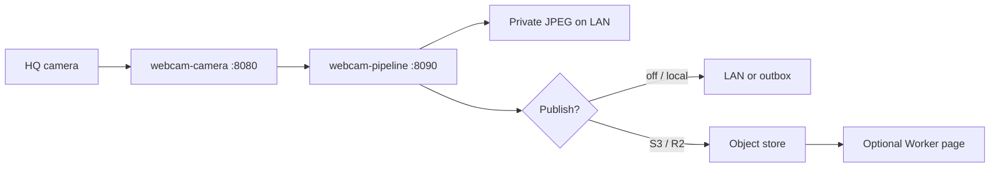
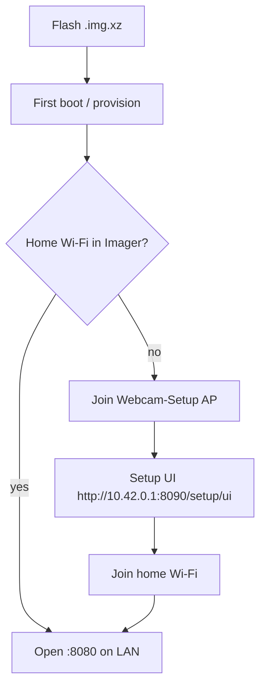

# DIY — build your own

Copy this repo onto a Raspberry Pi, point a High Quality Camera at a view you own, keep a private JPEG on the LAN, and optionally publish one privacy-filtered public JPEG to Cloudflare R2 or any S3-compatible store.

## How it works

Feature tour with LAN screenshots: [root README → Features](../../README.md#features).

## Docs

| Doc | What it is |
|-----|------------|
| [SHOPPING-LIST.md](SHOPPING-LIST.md) | **Minimum SD kit** first; NVMe/HAT/tall stand = reference build |
| [BUILD.md](BUILD.md) | Flash → setup AP → find the Pi on LAN → focus → optional publish / HA |
| [PUBLISH.md](PUBLISH.md) | Off / local outbox / R2 / custom S3 — public object URL without a Worker |
| [BEFORE-PUBLIC.md](BEFORE-PUBLIC.md) | Strip checklist if you add site-specific files before publishing |
| [examples/README.md](../../examples/README.md) | Camera / pipeline / Worker / HA templates |

**Buy first:** microSD + Pi 5 + HQ + CS lens + USB-C PD ([minimum kit](SHOPPING-LIST.md#minimum-kit-lan-only-microsd)). Cloudflare and NVMe are optional later.

**Public DIY repo:** [JavanXD/diy-home-webcam](https://github.com/JavanXD/diy-home-webcam) (clean history). Roadmap / open tasks: **[TODO.md](../../TODO.md)**.

Local smoke (no Pi): `make test` and `./scripts/smoke-local.sh` from the repo root.

## First boot

Details: [BUILD.md](BUILD.md).

## Photos

Files live in [`images/`](images/). Prefer LAN UI screenshots over the public website when the goal is “how to build this.” Do **not** commit neighbor windows unmasked, house numbers, or an unmasked private JPEG.

| File | Role |
|------|------|
| `images/lan-variants-masks.png` | Root README — Edit masks |
| `images/lan-camera-home.png` | Root README — live preview + focus meter |
| `images/lan-schedule.png` | Root README — solar schedule |
| `images/pi-camera-assembly.jpg` | HQ + 16 mm on stand at the window (close-up) |
| `images/pi-full-setup.jpg` | Shelf: Pi in official case + tall stand + CSI |
| `images/pi-nvme-hat-sd.jpg` | Parts flat-lay: case open, M.2 HAT+ Compact, NVMe, microSD |
| `images/public-page.png` | Optional: your own Worker landing or masked public JPEG |

